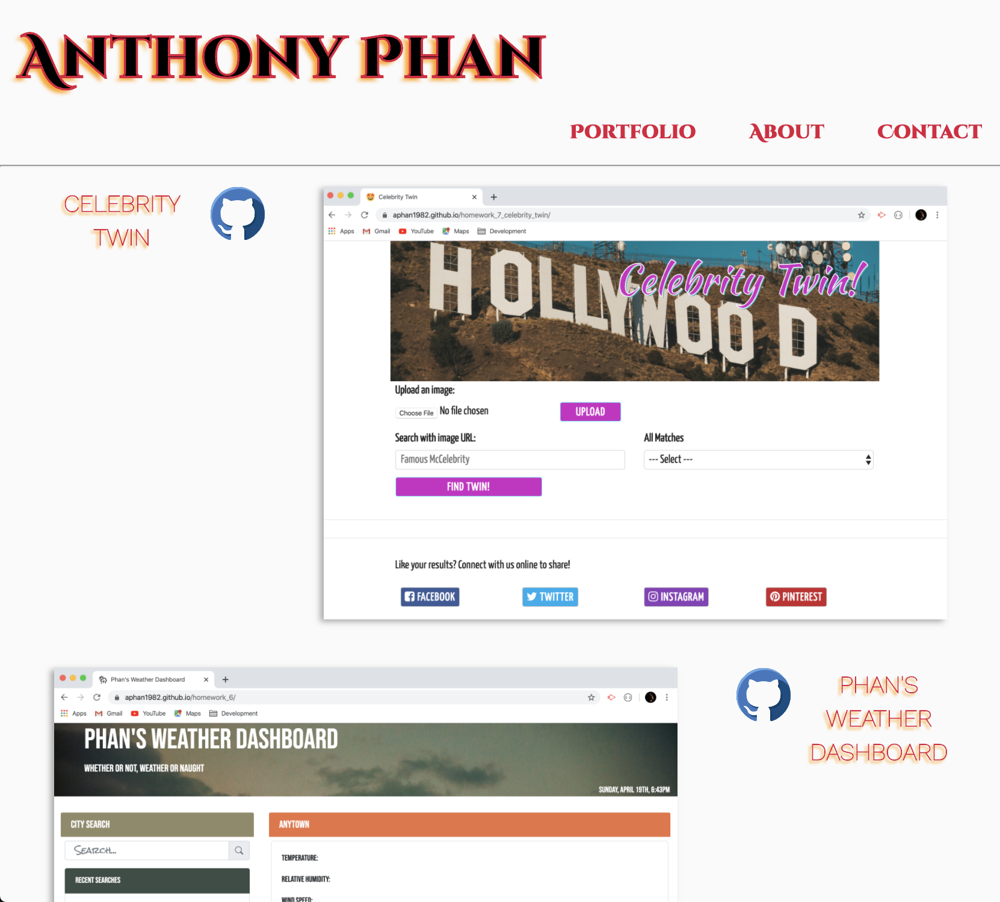
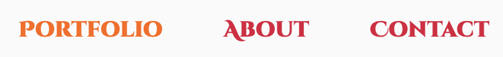
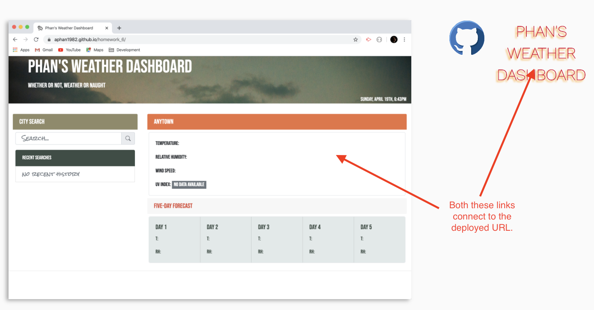
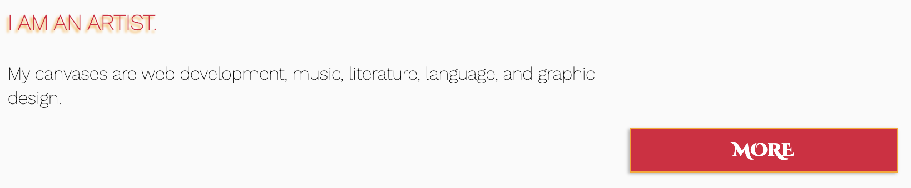
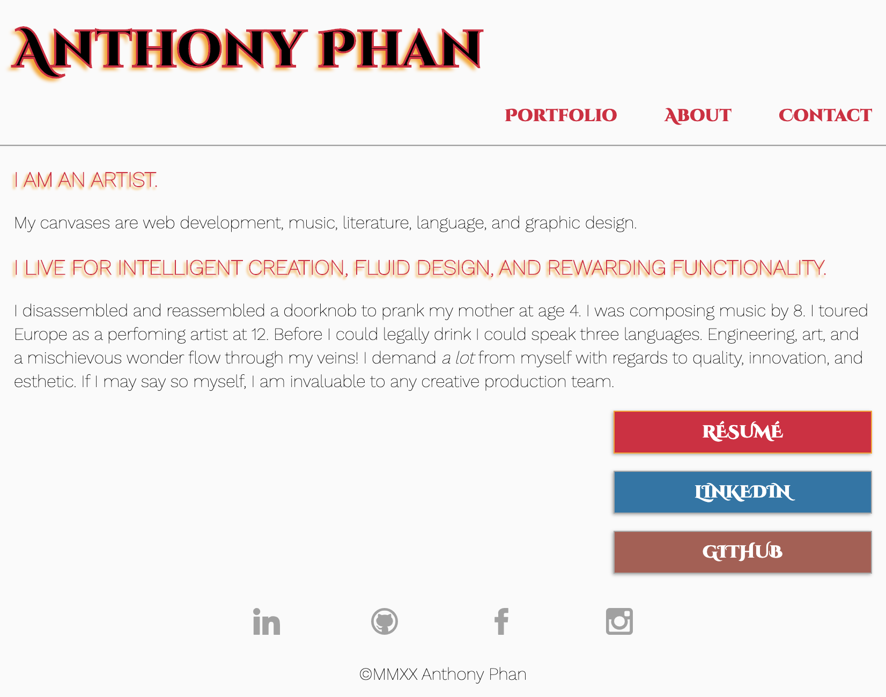
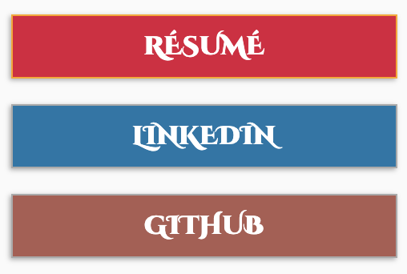
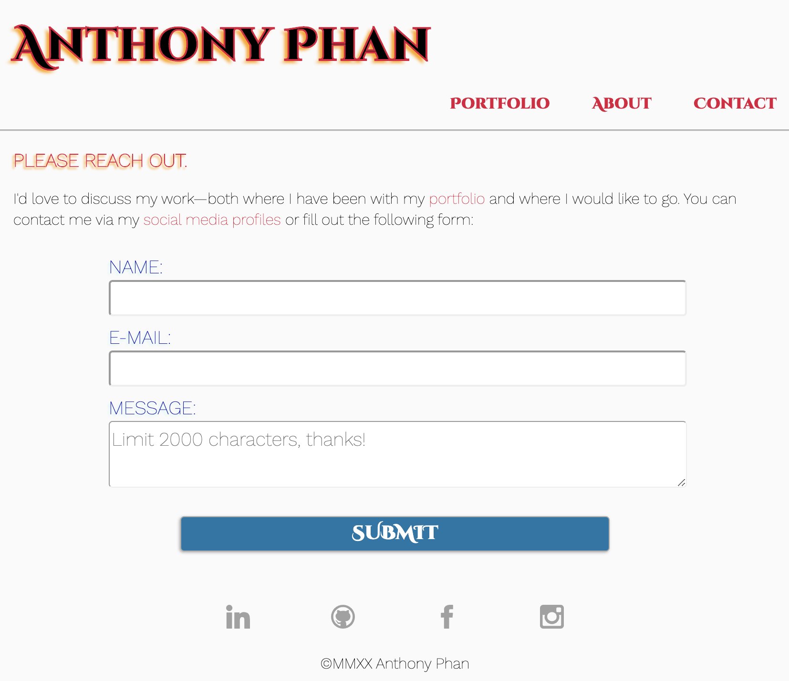

# Unit 08 Project 1 Homework: Professional Materials

[Anthony Phan—Porfolio](https://aphan1982.github.io/homework_8_updated_portfolio/) is my portfolio website. It has been completely re-envisioned since my first, [Bootstrap-formatted portfolio](https://aphan1982.github.io/homework_2/). I opted to start this assignment from scratch because I wanted to thoroughly ingrain the principles of CSS formatting and HTML syntax in my skillset rather than becoming dependent on frameworks to make my creations mobile-responsive and esthetically pleasing. There is much that I would love to tweak and refine; however, I feel that building this project from the ground up was invaluable to my knowledge and comfortability with manipulating CSS and the basic design elements used.

### [Launch my porfolio](https://aphan1982.github.io/homework_8_updated_portfolio/)

## Functionality of Site 
The whole of my portfolio was designed to be as clean and minimalistic as possible:

The `navbar` takes the user to any one of the pertinent fields of interest:

The `portfolio` section itself does not have anything by way of description copy. This is by design. Both `<h2>` and `` tags allow the user to link directly to my deployed websites, which are a better description than any cluttered copy might be:

Immediately adjacent to the `title` of the project is a [GitHub](https://github.com) link that takes the user directly to the `repository` where the source code is kept:

A brief `about` can be found at the bottom of the splash page:

Clicking on `more` will take the user to a dedicated `About` page:

Here the user can access my résumé `PDF`, or my [LinkedIn](https://www.linkedin.com/in/anthonyphan1982/) and [GitHub](https://github.com/aphan1982/) profiles by button links:

On all of the pages, `navigation` icons are displayed as `SVGs` that will take the user to other social media resource sites:

Though the `form` functionality does not exist at the moment to gather data or perform anything by way of e-mail communication, there is a dedicated `contact` page where the user can input correspondence information:

​
## Notes
Though this site was very rewarding to build, there are issues that I'd love to smooth out, especially with some layout and formatting things. I couldn't decide how much whitespace I should give the site; besides, I had toyed with the idea of adding some background images or perhaps a custom SVG logo or font style. All told, I believe that what I have here displays nicely even on very small mobile screens.